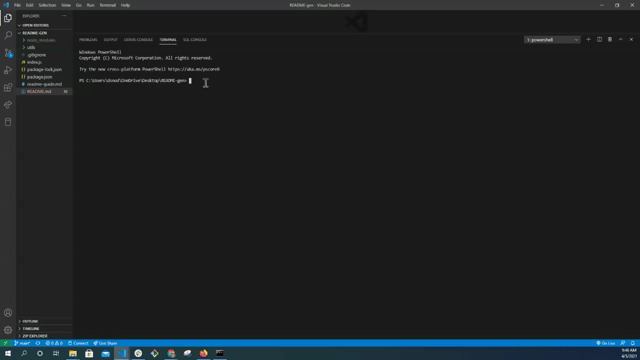

# README generator

  
  

  ## Table of Contents
  * [Description](#description)
  * [Installation](#installation)
  * [Usage](#usage)
  * [License](#license)
  * [Contributors](#contributors)
  * [Test](#test)
  * [Questions](#questions)

  ## Description 

  This application generates README files based off of the entries that are input into the prompted questions. README provides information about the application as well as the usage, installation, and instructions on how to use etc. 
  
  ## Installation 

  * npm init  
  * npm install inquirer
  
  ## Usage 

  

  VSCode
  1. Enter folder that holds index.js file
  2. In the terminal of VSCode enter: `node index.js`

  Terminal
  1. `cd` into folder containing index.js
  2. Enter `node index.js`
  ## License 

  
  
  ## Contributors 

  
  
  ## Test 

  
  
  ## Questions 

  
  Github: [testAccount](https://github.com/test)
  
  Email: [test@example.com]
  